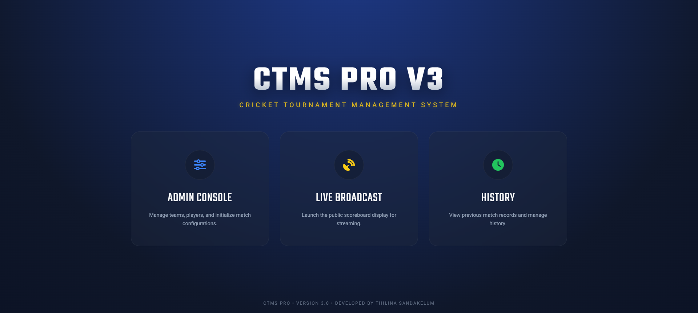
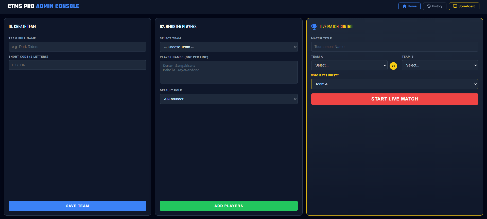
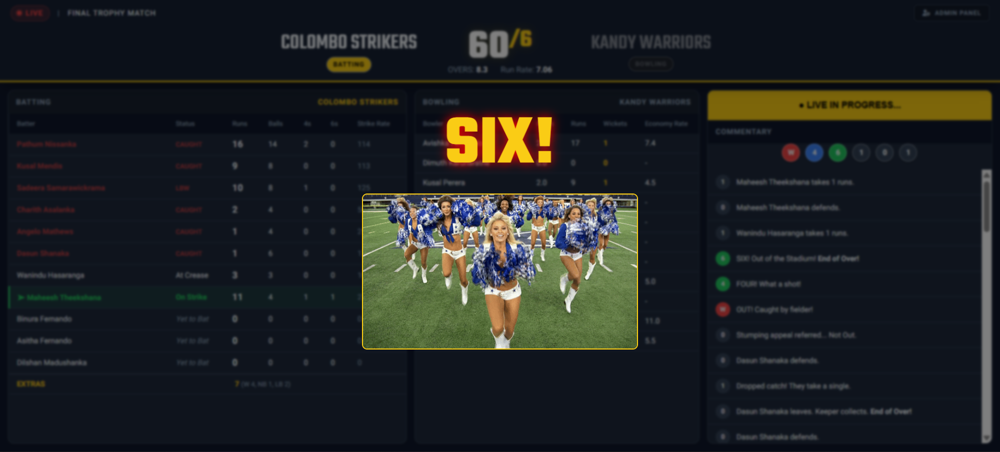
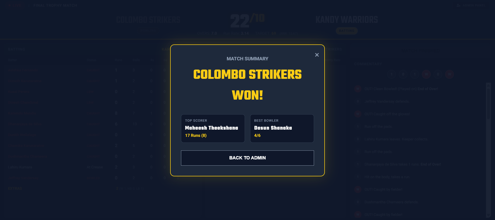
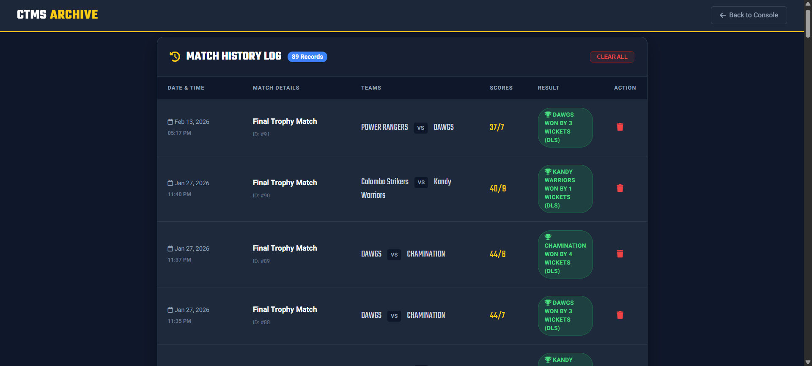

# CTMS PRO V3 - Cricket Tournament Management System 🏏

CTMS PRO V3 is a comprehensive, real-time web application designed for professional cricket tournament management. Developed using **PHP**, **AJAX**, and **MySQL**, the system provides a seamless experience for administrators and viewers with automated match logic and immersive multimedia elements.

## Key Features
* **AJAX-Powered Live Scoreboard:** Real-time match updates including scores, run rates, and ball-by-ball commentary without page refreshes.
* **Automated Match Logic:** Matches progress automatically based on pre-defined algorithms, simulating professional cricket scenarios.
* **Smart DLS Integration:** Dynamic rain-delay probability logic that automatically applies **DLS (Duckworth-Lewis-Stern)** target revisions if interruptions occur during the **2nd innings**.
* **Admin Control Panel:** Centralized hub to manage teams, player registrations, and initialize live match configurations.
* **Web Services Architecture:** High-performance data supply via JSON-based APIs to the live broadcast portal.
* **Match History Tracking:** A dedicated module to store and review previous tournament records and scorecards.

## Immersive Multimedia Experience
* **Interactive Animations:** Special visual celebrations including cheerleader animations triggered by boundaries (Sixes).
* **Real-time Audio Effects:** Dynamic sound effects for wickets, boundaries (audience cheers), and a celebratory **"Papare Band"** soundtrack for match winners.
* **Automated Celebrations:** Integrated match summary popups with victory announcements and final statistics.

## Interface Preview

### Homepage

### Admin Console

### Live Scoreboard

### Cheerleader Animation

### Winner

### Match Archive

## Tech Stack
* **Backend:** PHP 8.x
* **Database:** MySQL (ctms_prov3.sql)
* **Frontend:** HTML5, CSS3, JavaScript (AJAX)
* **Data Format:** JSON (via Web Services)
* **Asynchronous Communication:** AJAX (for real-time scoreboard updates without page reloads)
* **Multimedia Integration:** HTML5 Audio API (for crowd effects and Papare music) and GIF-based animation triggers

## Installation & Setup
1. Clone the repository into your local server (WAMP/XAMPP).
2. Create a database named `ctms_prov3` and import the `ctms_prov3.sql` script.
3. Ensure that `images/` and `sounds/` folders have correct read permissions.
4. Run the application via `localhost/ctmsprov3/index.php`.

---
*Developed by Thilina Sandakelum Wijesinghe - Software Technology Undergraduate @ University of Vocational Technology*
